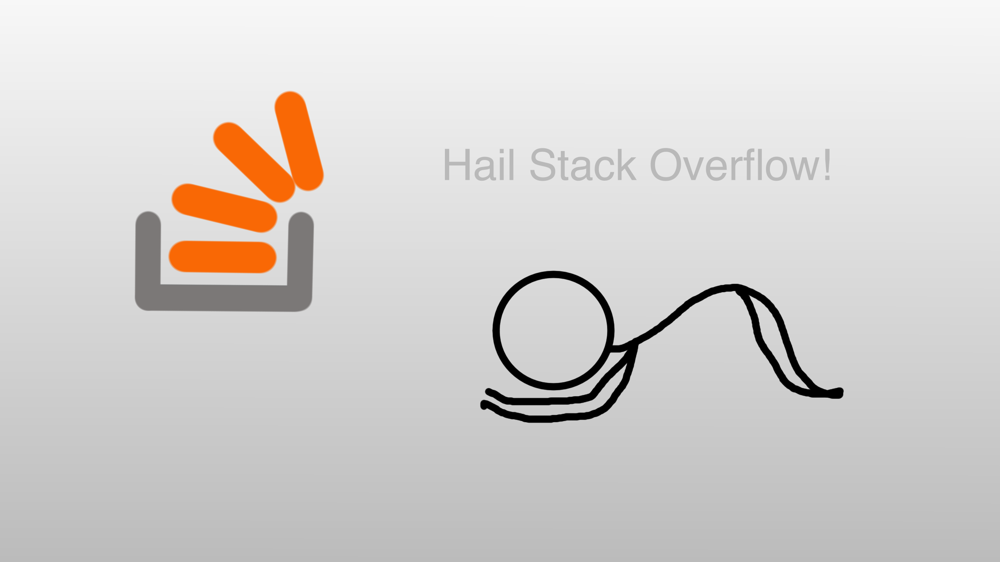

<h1 align='center'>Etudiant en développement web</h1>

    <h3>Je n'ai qu'un seul Dieu </h3>
    

 

 
    <h3>Je n'ai qu'une religion</h3>
    

 

<h1 align='center' style='margin-top:65px'>Mes techno favorites</h1>

 
    
    
    

 

 
    
        

 

